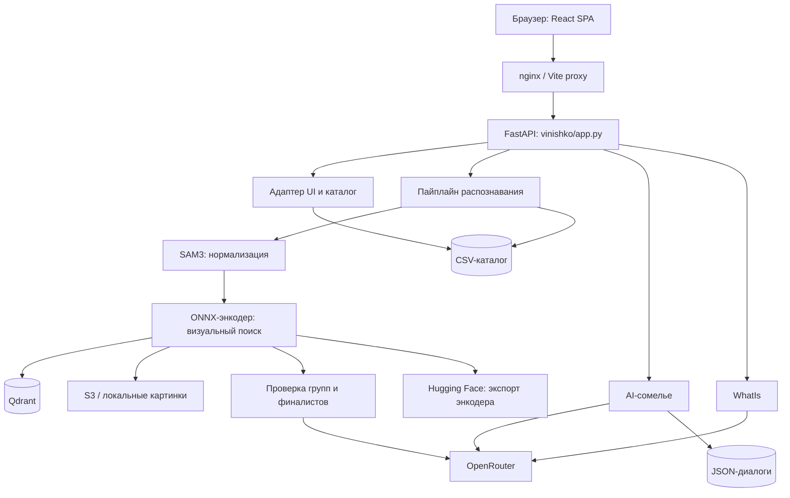
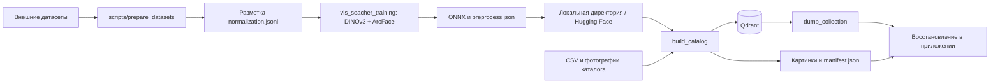

# Архитектура проекта «Своё Вино»

Документ описывает реализованную систему на 29 сентября 2026 года: веб-интерфейс, единое API, распознавание, AI-сервисы, хранение и обучение. Основание — Markdown-документация всего репозитория, структура, код приложения и текущие конфигурации. Запуск и эксплуатация описаны в [DOCS.md](DOCS.md).

## 1. Общая схема

Система состоит из React SPA, одного FastAPI-приложения, Qdrant и внешних источников моделей/данных. Сомелье и WhatIs — модули того же процесса приложения. Обучение и подготовка каталога запускаются отдельными инструментами и не входят в обработку пользовательского запроса.



В Docker nginx раздаёт frontend и сохраняет префикс `/api` при проксировании. В разработке роль прокси выполняет Vite. Браузер обращается к API через один origin. FastAPI также умеет раздавать локальный `frontend/dist` и поддерживает прямые ссылки SPA.

## 2. Границы компонентов

| Компонент | Ответственность | Основные файлы |
| --- | --- | --- |
| Приложение | Жизненный цикл, роутеры, прогрев, конфигурация и общие сервисы | `vinishko/app.py` |
| API распознавания | Чтение фото, запуск пайплайна, сериализация исходных результатов | `vinishko/pred/router.py`, `schemas.py` |
| Адаптер UI | Каталог карточек, нормализованные контуры, UI-контракт | `vinishko/pred/frontend.py`, `ui.py` |
| API оценки | Одна целевая бутылка, бюджет второго уровня, плоский slug | `vinishko/pred/eval.py` |
| Оркестратор | Связывает шаги, каталог и итоговые исходы | `vinishko/pred/pipeline/pipeline.py` |
| Нормализация | Маски бутылки/этикетки, отбор, геометрия и два кропа | `pipeline/steps/normalization/` |
| Визуальный поиск | ONNX-инференс, Qdrant, группы кандидатов, изображения и снапшоты | `pipeline/steps/vis_searcher/` |
| Второй уровень | Выбор точной позиции либо отказ через OpenRouter | `pipeline/steps/near_duplicates/` |
| Сомелье | Контекст вина, промпты, история и экспертная база | `vinishko/sommelier/` |
| WhatIs | Категория и винодельня неизвестной бутылки | `vinishko/whatis/` |
| Frontend | Камера, сценарий сканирования, выбор бутылки, карточки и чат | `frontend/src/` |
| Обучение | Данные, аугментации, DINOv3, лосс, валидация и экспорт | `vis_seacher_training/` |
| Инструменты | Подготовка датасетов, экспорт и сравнительные замеры | `scripts/` |

В таблице пути `pipeline/steps/...` находятся внутри `vinishko/pred/`. В модулях AI `router.py` отвечает за HTTP, `service.py` — за сценарий сервиса, `solution/` — за модель/промпты/настройки, `kb/` — за справочную базу. У сомелье есть дополнительный `storage.py`.

## 3. Жизненный цикл приложения

При запуске читается корневой `.env`, проверяется заданный общий прокси OpenRouter, создаются хранилище диалогов, сомелье и WhatIs. Затем создаётся или принимается внедрённый `Pipeline`, устанавливается общий замок распознавания, прогреваются модели и формируется UI-каталог.

Создание пайплайна включает загрузку нормализатора, энкодера, коллекции и CSV. Если коллекции нет, поиск пытается восстановить её из снапшота. До готовности проверяются согласованность модели, ревизии, размерности, входов, нормализации, изображений и slug каталога. Ошибка совместимости останавливает запуск.

`MAX_BOTTLES` веб-приложения по умолчанию 10 и переопределяет `selection.max_bottles=1` из standalone-конфига нормализации. Устройства `auto` выбирают CUDA при доступности, иначе CPU; явно заданное неподдерживаемое устройство вызывает ошибку.

Вычисления и декодирование выполняются вне event loop. Обычные вызовы пайплайна сериализованы `threading.Lock`: модели SAM3 и TensorRT engine не рассчитаны на одновременные вызовы одного экземпляра. Сомелье и WhatIs не ждут этот замок; внутри второго уровня запросы к OpenRouter параллельны с общим лимитом экземпляра. В eval под замком выполняются нормализация и поиск, резолвер вызывается после освобождения замка.

Несколько процессов позволяют увеличить параллелизм распознавания, но каждый загружает собственные модели и требует памяти. Это также требует отдельной оценки хранения диалогов: текущая файловая схема и очередь одной сессии не дают основания обещать распределённую координацию между процессами.

## 4. Контракты пайплайна

Шаги не знают друг о друге и не дописывают общий изменяемый объект. Общие типы находятся в `vinishko/pred/pipeline/structs.py`; выходы связывает оркестратор.

```text
Фото
  → Normalizer
    → BottleCrop | RejectedBottle
  → VisSearcher, только BottleCrop
    → BottleCandidates | UnmatchedBottle
  → NearDuplicateResolver, только BottleCandidates
    → MatchedBottle | UnmatchedBottle
  → PipelineResult и BottleOutcome
```

| Тип | Содержимое и смысл |
| --- | --- |
| `BottleCrop` | UUID, маски, скор отбора, угол, `crop`, `box_crop` и геометрия переходов |
| `RejectedBottle` | Маска и причина отказа нормализации либо позднего шага |
| `Candidate` | Slug, группа, score, scores по входам, метаданные и изображение позиции |
| `BottleCandidates` | Кроп запроса и список кандидатов поиска |
| `MatchedBottle` | Одна выбранная позиция, источник `group`/`final`, checklist |
| `UnmatchedBottle` | Кроп и отказ поиска/проверки |
| `Rejection` | Шаг, тип причины, пояснение и сообщение |
| `BottleOutcome` | Итог одной бутылки: match, кандидаты, отказ либо нормализация без поиска |

Причины каждого шага наследуют `Reason`: `NormalizationReason`, `SearchReason`, `NearDuplicateReason`. Поздний отказ сохраняет идентичность бутылки по UUID и отражается в итоговой разметке.

`PipelineResult` предоставляет исходную нормализацию, поиск, решения второго уровня, выбранные позиции, итоговые бутылки, разметку и время шагов. Отключение `search` или `resolve` позволяет оценивать отдельные части.

## 5. Нормализация изображения

1. Изображение открывается с EXIF-поворотом; прозрачность накладывается на белую подложку.
2. SAM3 ищет бутылки и этикетки, а также исключающие области крышки/горлышка. Для мелкой этикетки возможен второй проход по бутылке.
3. Калиброванный отбор оценивает кандидатов по признакам масок и изображения; проверяются читаемость, покрытие, размер и положение основной этикетки.
4. Ось бутылки определяется по маске, направление — по профилю ширины и положению в кадре. Короткие обрезанные бутылки не поворачиваются при неустойчивой оси.
5. Формируются два разных представления запроса.

| Представление | Назначение |
| --- | --- |
| `crop` | Полная ширина бутылки на высоте основной этикетки с запасом 20% вверх/вниз; фон по маске залит белым с растушёвкой |
| `box_crop` | Вся бутылка по bbox маски с запасом и сохранённым фоном; вход второго уровня и дополнительный вход поиска |

Маски и координаты сохраняются относительно исходного фото после EXIF. Отказы включают нецелевую бутылку, превышение лимита, отсутствие/неполноту/малый размер/размытость этикетки. Нормализация не заменяет отсутствие годной бутылки всем кадром по умолчанию: `selection.bypass=false`.

Геометрия и параметры рендеринга используются также в подготовке каталога и обучении, чтобы уменьшить расхождение представлений. `normalization.jsonl` хранит разметку, а обучающий загрузчик восстанавливает кропы с контролируемыми вариациями.

## 6. Визуальный поиск

По умолчанию используется экспорт SigLIP2 `pomelk1n/siglipus-twinturbo-gguf-umer`. Модель может быть заменена репозиторием Hugging Face или локальной директорией с тем же форматом экспорта. DINOv3 и TULIP — поддерживаемые альтернативы.

Предобработка задаётся `preprocess.json`: размер, вписывание `pad` или растяжение `squash`, цвет полей и интерполяция. ONNX принимает float32 RGB NCHW 0–255, нормировка встроена в граф, выход — L2-нормированный вектор. На CPU граф исполняет OpenVINO; на CUDA — TensorRT, с bf16 при поддержке либо float32. Engine кэшируется по модели/ревизии и характеристикам устройства.

### Гибрид и группы

Текущая коллекция `catalog_siglip2_hybrid` содержит именованные пространства `crop` и `box_crop`. Для каждого представления извлекается top-10; результаты объединяются по slug. Если позиция найдена только в одном пространстве, второй косинус вычисляется по её вектору из коллекции. Score позиции — среднее двух косинусов.

В режиме `groups` score группы — максимум score её найденных позиций. По умолчанию выбирается до пяти групп с score не ниже 0.7 и отставанием от лучшей не более 0.07. В кандидаты добавляются все проиндексированные члены выбранных групп: второй уровень должен видеть группу целиком. Если ни одна группа не прошла, поиск возвращает `no_match`.

Режим `top_n` предназначен для оценки поиска и не обеспечивает полный состав группы; текущий резолвер с ним несовместим. Косинусы группы и позиции остаются поисковыми оценками, не калиброванными вероятностями.

### Согласованность индекса

Payload хранит slug, группу и её состав, имя изображения, поля карточки, модель/ревизию, входы энкодера и отпечаток нормализации. Рядом с картинками находится `manifest.json` с конфигурацией кропа, fingerprint и временем сборки.

При старте проверяются:

- Наличие непустой коллекции и совпадение модели, ревизии, размерности и входов.
- Совпадение отпечатка точек с манифестом картинок.
- Совпадение текущих параметров рендеринга нормализатора с манифестом.
- Читаемость изображения первой точки и доступность хранилища.
- Наличие каждого slug коллекции в CSV.

Порог отбора, устройство и параметры записи файлов исключены из части нормализации, определяющей пиксели кропа. Каталог может иметь больше строк, чем индекс: фото некоторых позиций могли не пройти нормализацию.

## 7. Проверка точной позиции

Второй уровень получает `BottleCandidates`, изображение всей бутылки запроса и эталонные изображения кандидатов с карточками. Работа идёт в два круга:

1. Для каждой группы из нескольких позиций OpenRouter выбирает одну либо `not_found`; одиночки проходят к финалу. Групповые запросы всех бутылок выполняются параллельно.
2. Финальный запрос выбирает среди победителей групп и одиночек либо отказывает. Один финалист-одиночка также проверяется моделью. Финал пропускается, если единственного финалиста уже выбрала модель внутри группы.

Промпты проверяют надписи и дизайн, применяют правила винтажа и требуют указать противоречия в `differences` до выбора slug. Ответ ограничен схемой: один из переданных slug либо `not_found`. Обычный пользовательский API не подставляет top-1 при ошибке модели.

По текущему конфигу используется `deepseek/deepseek-v4.1-flash` через Together, без рассуждений в обоих кругах. Общий лимит — 8 одновременных запросов на экземпляр резолвера, включая его копии для trace. Для 429 и некоторых 5xx предусмотрены повторы в пределах таймаута 60 секунд. Изображения отправляются как JPEG q92; trace при включении сохраняется по UUID бутылки и кругу запроса.

Явный `not_found` — доменный отказ. Ошибка API, исчерпанный таймаут или нарушение схемы — техническая ошибка, а не доказательство отсутствия вина в каталоге.

## 8. Три внешних контракта распознавания

| Контракт | Представление | Политика |
| --- | --- | --- |
| `/recognize` | `bottles`, пиксельные контуры, исходные статусы и строки CSV | Результат пайплайна; отказ или ошибка не подменяются подтверждением |
| `/api/recognize` | Версия схемы, `detections`, нормализованные контуры и UI-карточки | Адаптация для браузера, matched/unmatched, до пяти похожих |
| `/v1/eval/predict` | Один slug или null | Выбор крупнейшей годной маски; top-1 при таймауте/ошибке резолвера |

API распознавания показывает только бутылки, прошедшие нормализацию; остальные входят в `ignored`. UI-адаптер сохраняет все компоненты маски. Неизвестные характеристики каталога и статистические метрики не синтезируются.

Eval имеет бюджет 8 секунд от начала обработки для вычисления остатка времени резолвера. Бюджет не прерывает нормализацию/поиск и ожидание замка; таймаут async-ожидания также не останавливает уже выполняющийся поток резолвера. Поэтому это механизм ограничения ожидания второго уровня, а не гарантия общего SLA.

## 9. Архитектура frontend

Frontend разделён по назначению:

```text
src/app        маршруты, оболочка, ScanProvider, стили
src/pages      ScannerPage, ScanResultPage, WinePage
src/entities   карточки вина
src/features   камера, сканирование, выбор, сессии, WhatIs, сомелье
src/shared     API, контракты, хранилище, геометрия и UI
src/mocks      подготовленные демонстрационные данные
```

Страницы получают данные через слой API. `RecognitionService` скрывает HTTP/mock-реализацию; режим выбирается один раз в `shared/api/service.ts`. Zod проверяет ответы на границе приложения. Компоненты не импортируют fixtures напрямую.

### Управление операцией

`ScanController` владеет Zustand store и переходами `idle → camera → preparing → recognizing → success/error`, включая состояние `slow`. Повторная загрузка запрещена во время текущей операции. Каждый асинхронный этап проверяет id операции и `AbortSignal`: поздний ответ отменённого запроса не меняет новую сессию. Retry переиспользует подготовленный Blob, но создаёт новый id.

### Геометрия и доступность

Фото, SVG-маски и clipping используют общую систему координат. `viewBox` соответствует размерам фото, contain реализован через `preserveAspectRatio`; нажатия переводятся обратной экранной матрицей SVG. Hit testing учитывает все компоненты маски. При пересечении выбирается меньшая площадь, затем стабильный id. Доступны отдельные кнопки выбора бутылки.

Sheet использует modal dialog, удержание/восстановление фокуса, Escape и блокировку прокрутки фона. Интерфейс поддерживает reduced motion, safe areas, `dvh` и зоны нажатия не менее 44 px.

### Восстановление состояния

IndexedDB хранит Blob, размеры, результат распознавания, выбранную бутылку, состояние sheet, похожее вино и позиции прокрутки. Записи сериализованы; перед переходом к карточке приложение дожидается сохранения. Лимит — 10 сессий на 7 дней. При недоступной IndexedDB используется память вкладки с предупреждением.

Blob URL создаётся заново после reload и освобождается при завершении жизненного цикла UI. `/scan/:id` восстанавливает результат; `/wine/:slug` поддерживает прямую ссылку и контекст возврата. Back/Forward не запускают recognize повторно.

WhatIs при открытии блока отправляет кроп выбранной неизвестной бутылки и сохраняет признаки в сканировании. Сомелье хранит в localStorage идентификатор диалога, а историю получает с сервера. После неоднозначного POST сначала загружается история, чтобы не дублировать сообщение.

## 10. Хранилища и внешние зависимости

| Хранилище/сервис | Данные и роль |
| --- | --- |
| CSV каталога | Исходные строки позиций; загружается один раз в память |
| Qdrant | Векторы, группы и payload; HNSW хранится в локальном томе |
| S3 `vino/catalog` | Изображения коллекции и манифест |
| S3 `vino/qdrant-snapshots` | Снапшоты Qdrant и паспорта |
| S3 `vino/dvc` | Большие артефакты разработки, отслеживаемые DVC |
| Hugging Face | Экспорты визуального энкодера |
| Кэш моделей | SAM3, энкодер, engine, изображения и скачанные снапшоты |
| JSON-файлы сессий | История сомелье; атомарная запись |
| IndexedDB браузера | Фото и локальная сессия сканирования |
| LocalStorage браузера | Идентификаторы диалогов |
| OpenRouter | Второй уровень, сомелье и WhatIs |

Поиск поддерживает локальное хранилище вместо S3. Кэш S3-изображений сбрасывается при изменении `built_at` манифеста, потому что имена файлов сохраняются между сборками.

Снапшот восстанавливается через приложение: паспорт → скачивание и sha256 → загрузка файла в Qdrant → проверка числа точек → обычные проверки. Qdrant не нужен прямой доступ к S3. Встроенный режим `qdrant.path` доступен для локальной отладки, но не поддерживает серверные снапшоты.

Сомелье хранит контекст карточки, альтернативы и сообщения в файловой сессии; операции одной сессии сериализованы. WhatIs использует справочник допустимых категорий/виноделен и не устанавливает точный slug.

## 11. Обучение и доставка модели



Обучаемый DINOv3 объединяет CLS и GeM по патч-токенам, затем использует BN → Linear → BN и L2-нормировку. Sub-center ArcFace учитывает размер класса. PCA-whitening и инициализация центров уменьшают деградацию предобученного бэкбона на старте; продолжение с более широкой головой поддерживает `widen_head`.

WineSensed служит обучающим источником; OFF и Products-10K участвуют в протоколах каталогов/негативов. Валидация измеряет recall, устойчивость к distractors и качество отказов, а также сохраняет визуальные промахи. Эксперименты пишут конфиги, логи, чекпоинты и экспорт модели.

Текущая рабочая конфигурация использует экспорт SigLIP2 через `scripts/export_siglip2`, а не обученный DINOv3. Одинаковый формат ONNX позволяет заменять семейство энкодера, но для каждой замены требуется соответствующий индекс и корректная предобработка.

## 12. Развёртывание, наблюдаемость и ограничения

Docker Compose содержит Qdrant 1.19.0, одноразовый readiness-check, приложение и nginx. CPU/GPU override меняет образ и доступ к устройству, TLS override — порты, сертификаты и конфиг nginx. Постоянные тома: `qdrant_storage`, `cache`, `sessions`.

`/health` предоставляет сведения о моделях и каталоге; структурированные результаты содержат время шагов и причины отказов. CLI оценки сохраняет отчёты, разметку, кропы, кандидатов и trace. Офлайн-тесты проверяют интеграционные контракты с подменой внешних вызовов; качество распознавания и задержки требуют отдельного прогона с моделями и данными.

Основные точки риска — качество исходного каталога, near-duplicates с одинаковыми фото, сетевые задержки OpenRouter, последовательная очередь распознавания и потребление памяти SAM3. Результат проверки каталога защищает от несовместимых выгрузок, но не выявляет все смысловые ошибки карточек или чужие фотографии.

Согласно отчёту от 29 сентября, frontend и часть интеграции проверены, полная CPU/GPU-сборка приложения и реальная интеграция всех внешних сервисов в том окружении не подтверждены. Исторические метрики не являются характеристиками любого текущего развёртывания.

## 13. Исторические решения и направления развития

В [CONTEXT.md](CONTEXT.md) сохранены ранние предложения: pgvector, DINOv3 ViT-B с CLS, геометрическая верификация ALIKED/LightGlue, отдельный OCR, фьюзер сигналов, дополнительные классификаторы и накопление пользовательских полевых пар. Эти компоненты не следует считать реализованными по одному описанию плана.

Фактические решения текущего дерева: Qdrant, SAM3, два кропа, гибрид SigLIP2, групповой поиск, двухкруговая проверка OpenRouter, CSV-каталог и единое FastAPI-приложение. Голова обучаемого DINOv3 использует CLS ⊕ GeM; фон нормализации белый. Устаревшие примеры путей и параметры в локальных README уточняются действующими конфигами, а история проверок — [frontend/qa/VERIFICATION.md](frontend/qa/VERIFICATION.md).
